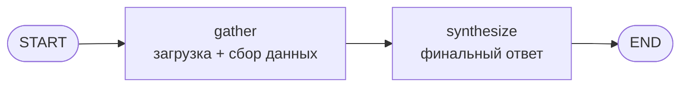
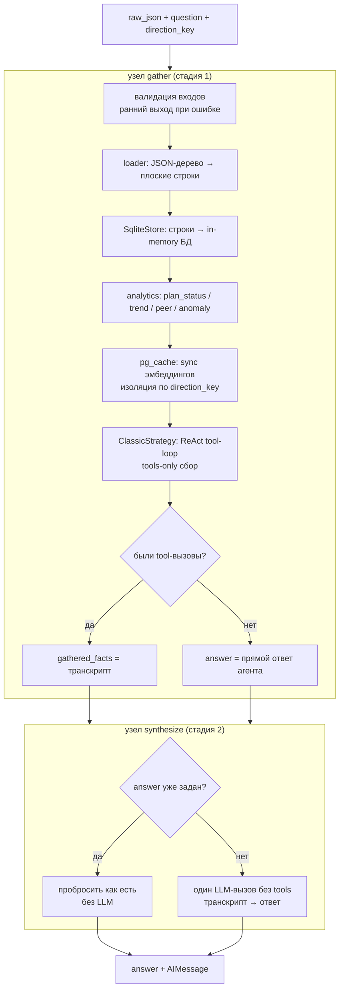
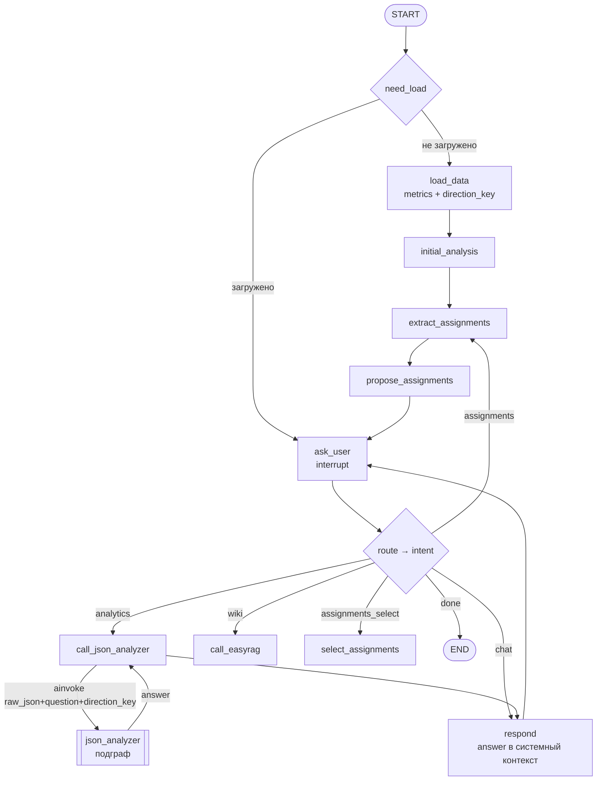

# Граф `json_analyzer`

Аналитический агент над **JSON-датасетом метрик** произвольного домена
(колл-центр, разработчики, клиентские менеджеры, руководство и т.д.).
На вход подаётся дерево метрик по людям и вопрос на естественном языке —
на выход возвращается текстовый аналитический ответ на русском.

Код: `langgraph_executor/aegra_agents/json_analyzer/`.

---

## Ключевые идеи

- **Двухстадийность.** Сбор данных (`gather`) и формулировка ответа
  (`synthesize`) разделены. У GigaChat запрос **с функциями** ограничен
  ~4096 токенами, поэтому сбор делается экономно с инструментами, а финальный
  синтез — **без функций**, куда можно вложить весь транскрипт целиком.
- **Строгий tools-only доступ.** LLM никогда не пишет SQL и не видит сырой
  датасет. Все данные — только через 11 типизированных инструментов поверх
  in-memory SQLite и pgvector.
- **Детерминированная аналитика.** Отклонения от плана/бенчмарка, динамика,
  тренды, peer-сравнение и аномалии считаются обычным кодом (без LLM) один раз
  при загрузке. Агент только читает готовые поля и не пересчитывает их.
- **Универсальность.** Названия метрик не хардкодятся — обходится то, что есть
  в JSON. Направление метрики берётся из поля `metric_type`
  (`прямая` — больше лучше, `обратная` — меньше лучше).

---

## Топология



`graph.py` собирает линейную цепочку из двух узлов и создаёт синглтоны
`llm` (GigaChat) и `graph` на уровне модуля:

```python
def build_graph(llm: GigaChat):
    g = StateGraph(JsonAnalyzerState)
    g.add_node("gather", make_gather_node(llm))
    g.add_node("synthesize", make_synthesize_node(llm))
    g.add_edge(START, "gather")
    g.add_edge("gather", "synthesize")
    g.add_edge("synthesize", END)
    return g.compile()

llm = create_gigachat_client().get_llm()
graph = build_graph(llm)
```

---

## Состояние (`state.py`)

```python
class JsonAnalyzerState(TypedDict, total=False):
    messages: Annotated[list[AnyMessage], add_messages]  # история чата
    raw_json: str | dict | None     # вход: JSON-датасет (dict или строка)
    question: str                   # вход: вопрос
    direction_key: str              # ключ изоляции pgvector-кэша
    parsed_rows: list[dict]         # промежуточное: плоские строки метрик
    gathered_facts: str             # промежуточное: транскрипт tool-вызовов
    completed: bool                 # уложился ли сбор в лимиты
    answer: str                     # итог
```

Входы (`raw_json`, `question`, `direction_key`) можно передать в state напрямую,
либо через `config.configurable`, либо вопрос — последним `HumanMessage`
(см. `_resolve_inputs`).

---

## Поток данных



---

## Узел 1 — `gather` (`nodes.py`)

Делает всё, кроме финальной формулировки ответа.

1. **Валидация входов** (`_resolve_inputs`). Если нет `raw_json`, `question`
   или `direction_key` — узел делает **ранний выход**, сразу записывая `answer`
   и `completed=True`. Стадия 2 тогда ничего не пересчитывает.
2. **Построение in-memory базы:**
   - `load_dataset_obj` (`loader.py`) — рекурсивно разворачивает дерево
     `me`/`employees` → `metrics` → `child_metrics` в плоский список строк
     (`metric_uid`, `parent_uid`, `depth`, поля `person_*` и метрики).
   - `SqliteStore()` (`sqlite_store.py`) — создаёт `:memory:` SQLite с таблицами
     `metrics` и `metric_analytics` и индексами; `.load(rows)` заливает строки.
   - `compute_analytics(store)` (`analytics.py`) — детерминированно считает
     производную аналитику в `metric_analytics`.
3. **pgvector-кэш** (`pg_cache.py`):
   - `PgCache()` — подключение к Postgres, таблица
     `json_analyzer.metric_embeddings`. Размерность вектора **читается из
     существующей колонки** (таблица создаётся миграцией, не кодом).
   - `sync_embeddings(...)` — эмбеддит только тексты (названия метрик, описания,
     значения `element`), которых ещё нет в кэше **для данного `direction_key`**
     (дедуп по `sha256(kind, content)` + `direction_key`).
4. **Стадия 1 — сбор данных агентом** (`agent_classic.py`):
   - `build_tools(...)` (`tools.py`) — 11 инструментов, замкнутых на хранилища.
   - `ClassicStrategy().build(llm, tools, schema_overview)` — ReAct-агент через
     `langchain.agents.create_agent` с `SYSTEM_PROMPT_RULES` + динамический
     «Состав датасета».
   - `.run(...)` — tool-loop через `stream`, возвращает `(collected, completed)`.
5. **Извлечение транскрипта** `extract_tool_transcript` (`agent_base.py`):
   - `tool_calls == 0` → агент ответил напрямую, кладём в `answer`.
   - иначе → `gathered_facts` (транскрипт) для синтеза.

`PgCache` закрывается в `finally`.

---

## Узел 2 — `synthesize` (`nodes.py`)

- Если `gather` уже выставил `answer` (ранний выход или нет tool-вызовов) —
  узел оборачивает его в `AIMessage` **без вызова LLM**.
- Иначе — **один вызов LLM без инструментов**: `SYNTHESIS_PROMPT` (system) +
  вопрос и транскрипт (human).
- Если `completed == False` (сбор упёрся в лимит) — к ответу дописывается
  примечание, что данные частичные.

---

## Детерминированная аналитика (`analytics.py`)

`compute_analytics` пишет в `metric_analytics` (направление — из `metric_type`):

| Поле | Что считает |
|---|---|
| `plan_status` / `plan_dev_abs/pct` | `лучше_плана` / `в_плане` / `хуже_плана` (порог «в плане» ±1 %) |
| `benchmark_status` / `benchmark_dev_*` | то же относительно бенчмарка |
| `pop_change_abs/pct` | изменение период-к-периоду по сериям `(person, metric, element)` |
| `pop_status` | **вердикт** изменения период-к-периоду с учётом направления: `улучшение` / `ухудшение` / `стабильно` |
| `trend` | `рост` / `падение` / `стабильно` (порог ±5 %, первый vs последний период) — направление ЗНАЧЕНИЯ |
| `trend_status` | **вердикт** тренда с учётом направления: `улучшение` / `ухудшение` / `стабильно` |
| `peer_mean/std/count/rank/percentile/zscore` | сравнение с коллегами в группе `(metric, element, date)`, **исключая `me`** |
| `peer_status` | **вердикт** позиции среди коллег с учётом направления: `лучше_коллег` / `на_уровне_коллег` / `хуже_коллег` |
| `is_anomaly` | `\|z-score\| ≥ порога` (`ANOMALY_ZSCORE_THRESHOLD`, дефолт 2.0) |

**Направление метрики и вердикты.** `metric_type` (`прямая` — больше лучше,
`обратная` — меньше лучше) применяется ко всем вердиктам-`*_status`
детерминированно, один раз при загрузке. Сырые `trend` (`рост`/`падение`),
`pop_change` и знак `zscore` — это направление **значения**, а не «хорошо/плохо»:
для `обратной` метрики рост значения = `ухудшение`, значение выше среднего
коллег = `хуже_коллег`. Агент и синтез опираются на `*_status`, а не разворачивают
направление сами — иначе слово `рост` сбивает модель на обратных метриках.

`build_summary` — стартовая сводка (охват, средние по метрикам последнего периода,
топ аномалий, счётчики трендов); доступна как инструмент `analytics_summary`.

---

## Инструменты агента (`tools.py`)

Все возвращают компактный JSON (пустые поля убираются, числа округляются,
длинные выборки помечаются как усечённые):

| # | Инструмент | Назначение |
|---|---|---|
| 1 | `schema_overview` | состав датасета (метрики/типы/element/люди/даты) |
| 2 | `resolve_entity(text, kind)` | нечёткое имя → каноничное; `metric`/`element` через pgvector (изоляция по `direction_key`), `person` — поиск по ФИО |
| 3 | `describe_metric` | описание, тип, единица, период |
| 4 | `get_metric` | значения + аналитика; без `element` — агрегат (или все разрезы для `agg-`) |
| 5 | `compare` | динамика по периодам (требует `person`) |
| 6 | `rank` | рейтинг сотрудников на дату (`peer_rank=1` — лучший) |
| 7 | `aggregate` | avg/min/max/sum/count по `person\|element\|date\|post` |
| 8 | `metric_tree` | иерархия «метрика + компоненты» с аналитикой (вопросы «почему / из чего состоит») |
| 9 | `list_people` | список людей с фильтрами |
| 10 | `find_flags(kind, ...)` | предрассчитанные строки по силе: `anomaly` / `below_plan` / `above_plan` / `declining` (динамика ухудшилась, с учётом направления) / `improving` (улучшилась) / `trend` (любое движение значения) — главный инструмент для широких вопросов |
| 11 | `analytics_summary` | общая сводка |

Важное различие, заложенное в промптах и инструментах: **динамика** во времени
(«просел / упал» → `find_flags(kind='declining')`, «вырос / улучшился» →
`kind='improving'`; оба учитывают направление метрики) и **отклонение от плана**
(«хуже плана» → `kind='below_plan'`) — это разные вопросы. Метрика бывает «хуже
плана», но с улучшающейся динамикой, и наоборот. `kind='trend'` отдаёт любое
движение ЗНАЧЕНИЯ (рост или падение) без вердикта «хорошо/плохо».

---

## Защита от зацикливания (`agent_classic.py`)

| Параметр | Значение | Смысл |
|---|---|---|
| `_TOOL_OUTPUT_CAP` | 6000 | усечение выдачи каждого инструмента |
| `_RECURSION_LIMIT` | 50 | жёсткий лимит шагов LangGraph |
| `_TOOL_CALL_BUDGET` | 18 | мягкий потолок числа вызовов → подсказка «заверши сбор» |
| `_MAX_REPEAT_BLOCKS` | 3 | сколько раз подряд можно игнорировать заглушку до принудительного завершения |

- **Дедуп вызовов**: повтор с теми же аргументами заменяется подсказкой
  `_REPEAT_NOTICE` вместо реального запуска.
- При `GraphRecursionError` — `completed=False`, но накопленные сообщения
  сохраняются (прогон через `stream`), и ответ синтезируется из частичного
  транскрипта.
- Счётчики (`_RunState`) — **per-run**, в замыкании guard'ов, чтобы конкурентные
  вызовы графа не портили друг другу состояние.

---

## Хранилище данных (`sqlite_store.py`)

- Таблицы `metrics` (из loader) и `metric_analytics` (из analytics), связаны по
  `metric_uid`.
- Наружу — только типизированные методы; агент SQL не пишет.
- Тонкости: пустая строка `element` ≠ `NULL`-агрегат; для метрик без агрегата
  (`agg-`) запросы возвращают все разрезы с пометкой `разрезы_вместо_агрегата`;
  `metric_tree` использует рекурсивный CTE.

---

## Окружение

| Переменная | Назначение |
|---|---|
| `GIGACHAT_CREDENTIALS`, `GIGACHAT_SCOPE`, `LLM_MODEL`, `EMBEDDINGS_MODEL` | GigaChat LLM и эмбеддинги |
| `POSTGRES_DSN` / `DATABASE_URL` | pgvector-кэш (sync psycopg; asyncpg-DSN конвертируется) |
| `ANOMALY_ZSCORE_THRESHOLD` | порог аномалий (дефолт 2.0) |

Таблица `json_analyzer.metric_embeddings` создаётся SQL-миграцией
(`migrations/json_analyzer/0001_initial.sql`); код её только читает и наполняет —
отсюда жёсткая проверка размерности вектора при инициализации `PgCache`.

---

## Структура модуля

| Файл | Роль |
|---|---|
| `graph.py` | сборка графа `START → gather → synthesize → END` |
| `state.py` | `JsonAnalyzerState` |
| `nodes.py` | узлы `gather` и `synthesize` |
| `loader.py` | JSON-дерево → плоские строки |
| `sqlite_store.py` | in-memory SQLite, типизированные запросы |
| `analytics.py` | детерминированный расчёт производных метрик |
| `pg_cache.py` | pgvector-кэш эмбеддингов + `sync_embeddings` |
| `tools.py` | 11 инструментов агента |
| `agent_classic.py` | стадия 1: ReAct tool-loop с защитой от зацикливания |
| `agent_base.py` | стадия 2: синтез ответа + форматирование транскрипта |
| `prompts.py` | `SYSTEM_PROMPT_RULES`, `SYNTHESIS_PROMPT` |

---

## Интеграция с оркестратором (`analytic_orchestrator`)

`json_analyzer` — это не самостоятельное приложение, а **подграф**, который
вызывает вышестоящий граф-оркестратор `analytic_orchestrator`. Оркестратор ведёт
диалог с руководителем по метрикам конкретного сотрудника и направляет
аналитические вопросы в `json_analyzer`.

### Как подключён подграф

`analytic_orchestrator/graph.py` импортирует скомпилированный граф как объект и
оборачивает его узлом:

```python
from ..json_analyzer.graph import graph as json_analyzer_graph
...
g.add_node("call_json_analyzer", make_call_json_analyzer_node(json_analyzer_graph))
g.add_edge("call_json_analyzer", "respond")
```

Это **вызов, а не встраивание**: `json_analyzer` дёргается через
`await json_analyzer_graph.ainvoke(...)` внутри узла, со своим собственным
state — оркестратор не делит с ним `OrchestratorState`. На каждый вызов подграф
заново пересобирает in-memory SQLite по `raw_json` и досчитывает pgvector-кэш по
`direction_key`.

### Маршрутизация по intent (single-label)

Узел `route` (`make_route_node`) классифицирует последнюю реплику пользователя
**одним ярлыком** через `ROUTER_PROMPT`. Ярлыки (`state.py`, тип `Intent`):

| intent | Куда ведёт `after_route` | Назначение |
|---|---|---|
| **`analytics`** | **`call_json_analyzer`** | вопрос про числа/динамику/рейтинги — считается по JSON метрик |
| `wiki` | `call_easyrag` | процессы, регламенты, методика — поиск во внутренней wiki |
| `assignments` | `extract_assignments` | оформить поручения сотруднику |
| `assignments_select` | `select_assignments` | служебный — форсится, пока висит `pending_assignments` |
| `chat` | `respond` | small-talk, уточнения (а также фоллбэк неизвестного ярлыка) |
| `done` | `END` | пользователь прощается |

В `json_analyzer` ведёт ровно **`analytics`** (`after_route`,
`nodes.py:423-424`). Если LLM вернул ярлык вне набора `_ROUTE_LABELS` —
он схлопывается в `chat`.

### Что передаётся на вход

Узел `call_json_analyzer` (`nodes.py:161-206`) собирает три входа из
`OrchestratorState` и вызывает подграф:

```python
result = await json_analyzer_graph.ainvoke({
    "raw_json": metrics,           # state["metrics"] — JSON-датасет метрик
    "question": last_text,         # последний HumanMessage
    "direction_key": direction_key # state["direction_key"]
})
```

Источники входов (все готовятся один раз в узле `load_data`, `nodes.py:33-78`):

- **`raw_json`** ← `state["metrics"]` — датасет, загруженный
  `GetBatchAgentDatasetByFiltersComponent` (dataset по умолчанию —
  `metrics_for_agent_analyst`) по фильтрам оргструктуры.
- **`question`** ← `_last_user_text(state)` — текст последней реплики
  руководителя.
- **`direction_key`** ← `IsuEmployeeOrgstructureInfo(...).direction_key()` —
  нормализованный ключ направления сотрудника; нужен `json_analyzer` для изоляции
  pgvector-кэша эмбеддингов между направлениями.

Узел делает **ранние выходы** (записывает `analytics_error` и не зовёт подграф),
если нет реплики, не загружены `metrics`, или пустой `direction_key`.

### Что делается с ответом

Подграф возвращает `result["answer"]`, который кладётся в state оркестратора как
**sticky-поле**:

```python
return {
    "analytics_question": last_text,
    "analytics_answer": result.get("answer") or None,
    "analytics_error": None,
}
```

После `call_json_analyzer` управление безусловно идёт в `respond`
(`g.add_edge("call_json_analyzer", "respond")`). Узел `respond` не пробрасывает
ответ дословно, а вкладывает его в **системный контекст** финального LLM-вызова
через `_metrics_system_block` (`nodes.py:465-476`):

```python
if state.get("analytics_answer") and not state.get("analytics_error"):
    return f"Ответ аналитика метрик:\n{state['analytics_answer']}"
```

То есть приоритет sticky: если `json_analyzer` хоть раз дал ответ без ошибки,
респондер опирается на него (а не на сырой JSON метрик) — это экономит токены и
снимает обрезание `metrics` под `_METRICS_PREVIEW_LIMIT`. При ошибке подграфа
(`analytics_error`) респондер откатывается на сырой JSON метрик как фоллбэк —
**сбой `json_analyzer` не валит оркестратор**.

### Поток вызова



### Контекст вызова

| Аспект | Значение |
|---|---|
| Способ | `await json_analyzer_graph.ainvoke({...})` внутри узла |
| Условие захода | `intent == "analytics"` |
| Вход | `raw_json` (метрики), `question` (реплика), `direction_key` |
| Выход | `result["answer"]` → `state["analytics_answer"]` (sticky) |
| Использование | в системном промпте узла `respond` (приоритет над сырым JSON) |
| Изоляция ошибок | `try/except`, ошибка → `analytics_error`, фоллбэк на сырой JSON |
| Соседний подграф | `easyrag` (ветка `wiki`) — устроен симметрично |
